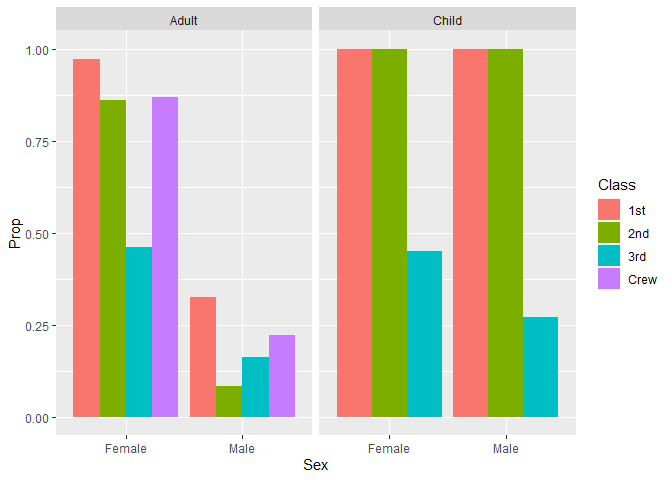

RMS Titanic
================
Van Myers
2023-Feb-1

- <a href="#grading-rubric" id="toc-grading-rubric">Grading Rubric</a>
  - <a href="#individual" id="toc-individual">Individual</a>
  - <a href="#due-date" id="toc-due-date">Due Date</a>
- <a href="#first-look" id="toc-first-look">First Look</a>
  - <a
    href="#q1-perform-a-glimpse-of-df_titanic-what-variables-are-in-this-dataset"
    id="toc-q1-perform-a-glimpse-of-df_titanic-what-variables-are-in-this-dataset"><strong>q1</strong>
    Perform a glimpse of <code>df_titanic</code>. What variables are in this
    dataset?</a>
  - <a
    href="#q2-skim-the-wikipedia-article-on-the-rms-titanic-and-look-for-a-total-count-of-souls-aboard-compare-against-the-total-computed-below-are-there-any-differences-are-those-differences-large-or-small-what-might-account-for-those-differences"
    id="toc-q2-skim-the-wikipedia-article-on-the-rms-titanic-and-look-for-a-total-count-of-souls-aboard-compare-against-the-total-computed-below-are-there-any-differences-are-those-differences-large-or-small-what-might-account-for-those-differences"><strong>q2</strong>
    Skim the Wikipedia article on the RMS Titanic, and look for a total
    count of souls aboard. Compare against the total computed below. Are
    there any differences? Are those differences large or small? What might
    account for those differences?</a>
  - <a
    href="#q3-create-a-plot-showing-the-count-of-persons-who-did-survive-along-with-aesthetics-for-class-and-sex-document-your-observations-below"
    id="toc-q3-create-a-plot-showing-the-count-of-persons-who-did-survive-along-with-aesthetics-for-class-and-sex-document-your-observations-below"><strong>q3</strong>
    Create a plot showing the count of persons who <em>did</em> survive,
    along with aesthetics for <code>Class</code> and <code>Sex</code>.
    Document your observations below.</a>
- <a href="#deeper-look" id="toc-deeper-look">Deeper Look</a>
  - <a
    href="#q4-replicate-your-visual-from-q3-but-display-prop-in-place-of-n-document-your-observations-and-note-any-newdifferent-observations-you-make-in-comparison-with-q3-is-there-anything-fishy-in-your-plot"
    id="toc-q4-replicate-your-visual-from-q3-but-display-prop-in-place-of-n-document-your-observations-and-note-any-newdifferent-observations-you-make-in-comparison-with-q3-is-there-anything-fishy-in-your-plot"><strong>q4</strong>
    Replicate your visual from q3, but display <code>Prop</code> in place of
    <code>n</code>. Document your observations, and note any new/different
    observations you make in comparison with q3. Is there anything
    <em>fishy</em> in your plot?</a>
  - <a
    href="#q5-create-a-plot-showing-the-group-proportion-of-occupants-who-did-survive-along-with-aesthetics-for-class-sex-and-age-document-your-observations-below"
    id="toc-q5-create-a-plot-showing-the-group-proportion-of-occupants-who-did-survive-along-with-aesthetics-for-class-sex-and-age-document-your-observations-below"><strong>q5</strong>
    Create a plot showing the group-proportion of occupants who <em>did</em>
    survive, along with aesthetics for <code>Class</code>, <code>Sex</code>,
    <em>and</em> <code>Age</code>. Document your observations below.</a>
- <a href="#notes" id="toc-notes">Notes</a>

*Purpose*: Most datasets have at least a few variables. Part of our task
in analyzing a dataset is to understand trends as they vary across these
different variables. Unless we’re careful and thorough, we can easily
miss these patterns. In this challenge you’ll analyze a dataset with a
small number of categorical variables and try to find differences among
the groups.

*Reading*: (Optional) [Wikipedia
article](https://en.wikipedia.org/wiki/RMS_Titanic) on the RMS Titanic.

<!-- include-rubric -->

# Grading Rubric

<!-- -------------------------------------------------- -->

Unlike exercises, **challenges will be graded**. The following rubrics
define how you will be graded, both on an individual and team basis.

## Individual

<!-- ------------------------- -->

| Category    | Needs Improvement                                                                                                | Satisfactory                                                                                                               |
|-------------|------------------------------------------------------------------------------------------------------------------|----------------------------------------------------------------------------------------------------------------------------|
| Effort      | Some task **q**’s left unattempted                                                                               | All task **q**’s attempted                                                                                                 |
| Observed    | Did not document observations, or observations incorrect                                                         | Documented correct observations based on analysis                                                                          |
| Supported   | Some observations not clearly supported by analysis                                                              | All observations clearly supported by analysis (table, graph, etc.)                                                        |
| Assessed    | Observations include claims not supported by the data, or reflect a level of certainty not warranted by the data | Observations are appropriately qualified by the quality & relevance of the data and (in)conclusiveness of the support      |
| Specified   | Uses the phrase “more data are necessary” without clarification                                                  | Any statement that “more data are necessary” specifies which *specific* data are needed to answer what *specific* question |
| Code Styled | Violations of the [style guide](https://style.tidyverse.org/) hinder readability                                 | Code sufficiently close to the [style guide](https://style.tidyverse.org/)                                                 |

## Due Date

<!-- ------------------------- -->

All the deliverables stated in the rubrics above are due **at midnight**
before the day of the class discussion of the challenge. See the
[Syllabus](https://docs.google.com/document/d/1qeP6DUS8Djq_A0HMllMqsSqX3a9dbcx1/edit?usp=sharing&ouid=110386251748498665069&rtpof=true&sd=true)
for more information.

``` r
library(tidyverse)
```

    ## ── Attaching packages ─────────────────────────────────────── tidyverse 1.3.2 ──
    ## ✔ ggplot2 3.4.0      ✔ purrr   1.0.1 
    ## ✔ tibble  3.1.8      ✔ dplyr   1.0.10
    ## ✔ tidyr   1.3.0      ✔ stringr 1.5.0 
    ## ✔ readr   2.1.3      ✔ forcats 0.5.2 
    ## ── Conflicts ────────────────────────────────────────── tidyverse_conflicts() ──
    ## ✖ dplyr::filter() masks stats::filter()
    ## ✖ dplyr::lag()    masks stats::lag()

``` r
df_titanic <- as_tibble(Titanic)
```

*Background*: The RMS Titanic sank on its maiden voyage in 1912; about
67% of its passengers died.

# First Look

<!-- -------------------------------------------------- -->

### **q1** Perform a glimpse of `df_titanic`. What variables are in this dataset?

``` r
## TASK: Perform a `glimpse` of df_titanic
glimpse(df_titanic)
```

    ## Rows: 32
    ## Columns: 5
    ## $ Class    <chr> "1st", "2nd", "3rd", "Crew", "1st", "2nd", "3rd", "Crew", "1s…
    ## $ Sex      <chr> "Male", "Male", "Male", "Male", "Female", "Female", "Female",…
    ## $ Age      <chr> "Child", "Child", "Child", "Child", "Child", "Child", "Child"…
    ## $ Survived <chr> "No", "No", "No", "No", "No", "No", "No", "No", "No", "No", "…
    ## $ n        <dbl> 0, 0, 35, 0, 0, 0, 17, 0, 118, 154, 387, 670, 4, 13, 89, 3, 5…

**Observations**:

- Class, Sex, Age, Age, Survived, n

### **q2** Skim the [Wikipedia article](https://en.wikipedia.org/wiki/RMS_Titanic) on the RMS Titanic, and look for a total count of souls aboard. Compare against the total computed below. Are there any differences? Are those differences large or small? What might account for those differences?

``` r
## NOTE: No need to edit! We'll cover how to
## do this calculation in a later exercise.
df_titanic %>% summarize(total = sum(n))
```

    ## # A tibble: 1 × 1
    ##   total
    ##   <dbl>
    ## 1  2201

**Observations**:

- Write your observations here
- Are there any differences?
  - There is a difference of 23 more people reported by the Wikipedia
    estimate.
- If yes, what might account for those differences?
  - They appear to be using a different data set. That data set combines
    sexes of children and reports a dead first class child which the
    data set in R does not.
  - These data are estimations so it could just be estimations that used
    different methodology or one is more up to date.

### **q3** Create a plot showing the count of persons who *did* survive, along with aesthetics for `Class` and `Sex`. Document your observations below.

*Note*: There are many ways to do this.

``` r
## TASK: Visualize counts against `Class` and `Sex`

df_titanic %>%
  filter(Survived == "Yes") %>%
  ggplot(aes(x = Sex, y = n, fill = Class)) +
  geom_col()
```

<!-- -->

**Observations**:

- n.b. I’m using the language of gender in place of sex because the
  former is awkward. I also suspect there is no practical difference in
  these data and the source may be making the same conflation I am.
- More men survived than women.
- Of those surviving men, a narrow majority were crew.
- Few crew are among the surviving women.
- Instead, there is a plurality of 1st class passengers among surviving
  women.
- Very few 2nd class men survived.
- The number of 3rd class survivors is most similar across sex when
  compared to other classes.

# Deeper Look

<!-- -------------------------------------------------- -->

Raw counts give us a sense of totals, but they are not as useful for
understanding differences between groups. This is because the
differences we see in counts could be due to either the relative size of
the group OR differences in outcomes for those groups. To make
comparisons between groups, we should also consider *proportions*.\[1\]

The following code computes proportions within each `Class, Sex, Age`
group.

``` r
## NOTE: No need to edit! We'll cover how to
## do this calculation in a later exercise.
df_prop <-
  df_titanic %>%
  group_by(Class, Sex, Age) %>%
  mutate(
    Total = sum(n),
    Prop = n / Total
  ) %>%
  filter(!is.nan(Prop)) %>% # there are no crew children lets ignore those groups
  ungroup()
df_prop
```

    ## # A tibble: 28 × 7
    ##    Class Sex    Age   Survived     n Total  Prop
    ##    <chr> <chr>  <chr> <chr>    <dbl> <dbl> <dbl>
    ##  1 1st   Male   Child No           0     5 0    
    ##  2 2nd   Male   Child No           0    11 0    
    ##  3 3rd   Male   Child No          35    48 0.729
    ##  4 1st   Female Child No           0     1 0    
    ##  5 2nd   Female Child No           0    13 0    
    ##  6 3rd   Female Child No          17    31 0.548
    ##  7 1st   Male   Adult No         118   175 0.674
    ##  8 2nd   Male   Adult No         154   168 0.917
    ##  9 3rd   Male   Adult No         387   462 0.838
    ## 10 Crew  Male   Adult No         670   862 0.777
    ## # … with 18 more rows

### **q4** Replicate your visual from q3, but display `Prop` in place of `n`. Document your observations, and note any new/different observations you make in comparison with q3. Is there anything *fishy* in your plot?

``` r
df_prop %>%
  filter(Survived == "Yes") %>%
  ggplot(aes(x = Sex, y = Prop, fill = Class)) +
  geom_col(position = "dodge")
```

<!-- -->

``` r
df_prop %>%
  filter(Survived == "Yes")
```

    ## # A tibble: 14 × 7
    ##    Class Sex    Age   Survived     n Total   Prop
    ##    <chr> <chr>  <chr> <chr>    <dbl> <dbl>  <dbl>
    ##  1 1st   Male   Child Yes          5     5 1     
    ##  2 2nd   Male   Child Yes         11    11 1     
    ##  3 3rd   Male   Child Yes         13    48 0.271 
    ##  4 1st   Female Child Yes          1     1 1     
    ##  5 2nd   Female Child Yes         13    13 1     
    ##  6 3rd   Female Child Yes         14    31 0.452 
    ##  7 1st   Male   Adult Yes         57   175 0.326 
    ##  8 2nd   Male   Adult Yes         14   168 0.0833
    ##  9 3rd   Male   Adult Yes         75   462 0.162 
    ## 10 Crew  Male   Adult Yes        192   862 0.223 
    ## 11 1st   Female Adult Yes        140   144 0.972 
    ## 12 2nd   Female Adult Yes         80    93 0.860 
    ## 13 3rd   Female Adult Yes         76   165 0.461 
    ## 14 Crew  Female Adult Yes         20    23 0.870

``` r
# This is a fixed version to satisfy the objective without changing which
# variables the plot displays

df_no_age <-
  df_titanic %>%
  group_by(Class, Sex) %>%
  mutate(
    Total = sum(n),
    Prop = n / Total
  ) %>%
  ungroup()

df_no_age %>%
  filter(Survived == "Yes") %>%
  ggplot(aes(x = Sex, y = Prop, fill = Class)) +
  geom_col(position = "dodge")
```

<!-- -->

**Observations**:

- This plot says all first and seconds class passengers survived which I
  suspect is wrong.
- About 87% of female crew members survived.
- Male crew members were less likely to survive than male 3rd class
  passengers while the opposite was true for female 3rd class passengers
  and crew members.
- Is there anything *fishy* going on in your plot?
  - Simple subsitution is not sufficient. Prop is calculated within
    Class, Sex, and Age but the plot is adding proportions within Sex.
    This results in proportions that appear to be 1 because `ggplot`
    sees the `Prop` values for children first and plots those. Changing
    the position to `dodge` to more appropriately display proportions
    does not fix this. The plot isn’t appropriate, but it appears I am
    not supposed to fix this until the next part.

### **q5** Create a plot showing the group-proportion of occupants who *did* survive, along with aesthetics for `Class`, `Sex`, *and* `Age`. Document your observations below.

*Hint*: Don’t forget that you can use `facet_grid` to help consider
additional variables!

``` r
df_prop %>%
  filter(Survived == "Yes") %>%
  ggplot(aes(x = Sex, y = Prop, fill = Class)) +
  geom_col(position = "dodge") +
  facet_wrap(~ Age)
```

<!-- -->

**Observations**:

- All first and second class children survived
- Under 50% of female 3rd class children survived and just over 25% of
  male 3rd class children survived
- Very few adult men survived. Still about 30% of first class men did,
  more than 3rd class boys.
- Among adult men, a higher proportion of third class passengers
  survived than second class, and an even higher proportion of male crew
  survived (still less than 25%).
- Almost all adult first class women survived and about 87% in second
  class and among crew. A slightly higher proportion of crew survived
  than second class.
- The proportion of surviving third class adult women and girls is
  approximately the same. This is the only case of where this is true.
- If you saw something *fishy* in q4 above, use your new plot to explain
  the fishy-ness.
  - Explained above. The plotting function plots the first value it sees
    matching the aesthetics, so it plots the proportions among children
    only except for crew.

# Notes

<!-- -------------------------------------------------- -->

\[1\] This is basically the same idea as [Dimensional
Analysis](https://en.wikipedia.org/wiki/Dimensional_analysis); computing
proportions is akin to non-dimensionalizing a quantity.
