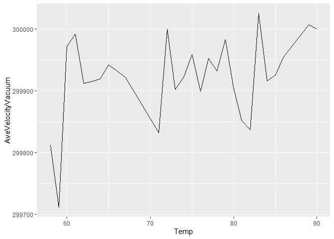
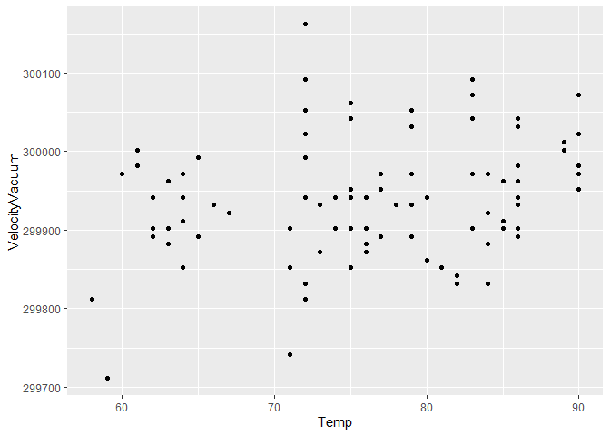
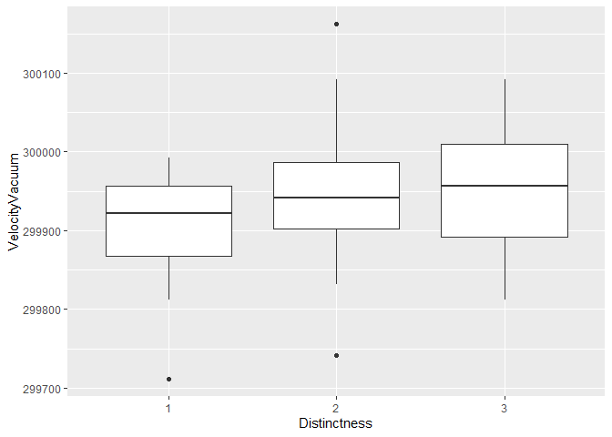

Michelson Speed-of-light Measurements
================
Van Myers
2020-02-08

- <a href="#grading-rubric" id="toc-grading-rubric">Grading Rubric</a>
  - <a href="#individual" id="toc-individual">Individual</a>
  - <a href="#due-date" id="toc-due-date">Due Date</a>
    - <a
      href="#q1-re-create-the-following-table-from-michelson-1880-pg-139-using-df_michelson-and-dplyr-note-that-your-values-will-not-match-those-of-michelson-exactly-why-might-this-be"
      id="toc-q1-re-create-the-following-table-from-michelson-1880-pg-139-using-df_michelson-and-dplyr-note-that-your-values-will-not-match-those-of-michelson-exactly-why-might-this-be"><strong>q1</strong>
      Re-create the following table (from Michelson (1880), pg. 139) using
      <code>df_michelson</code> and <code>dplyr</code>. Note that your values
      <em>will not</em> match those of Michelson <em>exactly</em>; why might
      this be?</a>
    - <a
      href="#q2-create-a-new-variable-velocityvacuum-with-the-92-kms-adjustment-to-velocity-assign-this-new-dataframe-to-df_q2"
      id="toc-q2-create-a-new-variable-velocityvacuum-with-the-92-kms-adjustment-to-velocity-assign-this-new-dataframe-to-df_q2"><strong>q2</strong>
      Create a new variable <code>VelocityVacuum</code> with the <span
      class="math inline"> + 92</span> km/s adjustment to
      <code>Velocity</code>. Assign this new dataframe to
      <code>df_q2</code>.</a>
    - <a
      href="#q3-compare-michelsons-speed-of-light-estimate-against-the-modern-speed-of-light-value-is-michelsons-estimate-of-the-error-his-uncertainty-greater-or-less-than-the-true-error"
      id="toc-q3-compare-michelsons-speed-of-light-estimate-against-the-modern-speed-of-light-value-is-michelsons-estimate-of-the-error-his-uncertainty-greater-or-less-than-the-true-error"><strong>q3</strong>
      Compare Michelson’s speed of light estimate against the modern speed of
      light value. Is Michelson’s estimate of the error (his uncertainty)
      greater or less than the true error?</a>
    - <a
      href="#q4-inspect-the-following-plot-with-the-real-michelson-data-and-simulated-data-from-a-probability-model-document-the-similarities-and-differences-between-the-data-under-observe-below"
      id="toc-q4-inspect-the-following-plot-with-the-real-michelson-data-and-simulated-data-from-a-probability-model-document-the-similarities-and-differences-between-the-data-under-observe-below"><strong>q4</strong>
      Inspect the following plot with the <code>Real</code> Michelson data and
      <code>Simulated</code> data from a probability model. Document the
      similarities and differences between the data under <em>observe</em>
      below.</a>
    - <a
      href="#q5-you-have-access-to-a-few-other-variables-construct-a-few-visualizations-of-velocityvacuum-against-these-other-factors-are-there-other-patterns-in-the-data-that-might-help-explain-the-difference-between-michelsons-estimate-and-lightspeed_vacuum"
      id="toc-q5-you-have-access-to-a-few-other-variables-construct-a-few-visualizations-of-velocityvacuum-against-these-other-factors-are-there-other-patterns-in-the-data-that-might-help-explain-the-difference-between-michelsons-estimate-and-lightspeed_vacuum"><strong>q5</strong>
      You have access to a few other variables. Construct a few visualizations
      of <code>VelocityVacuum</code> against these other factors. Are there
      other patterns in the data that might help explain the difference
      between Michelson’s estimate and <code>LIGHTSPEED_VACUUM</code>?</a>
  - <a href="#bibliography" id="toc-bibliography">Bibliography</a>

*Purpose*: When studying physical problems, there is an important
distinction between *error* and *uncertainty*. The primary purpose of
this challenge is to dip our toes into these factors by analyzing a real
dataset.

*Reading*: [Experimental Determination of the Velocity of
Light](https://play.google.com/books/reader?id=343nAAAAMAAJ&hl=en&pg=GBS.PA115)
(Optional)

<!-- include-rubric -->

# Grading Rubric

<!-- -------------------------------------------------- -->

Unlike exercises, **challenges will be graded**. The following rubrics
define how you will be graded, both on an individual and team basis.

## Individual

<!-- ------------------------- -->

| Category    | Needs Improvement                                                                                                | Satisfactory                                                                                                               |
|-------------|------------------------------------------------------------------------------------------------------------------|----------------------------------------------------------------------------------------------------------------------------|
| Effort      | Some task **q**’s left unattempted                                                                               | All task **q**’s attempted                                                                                                 |
| Observed    | Did not document observations, or observations incorrect                                                         | Documented correct observations based on analysis                                                                          |
| Supported   | Some observations not clearly supported by analysis                                                              | All observations clearly supported by analysis (table, graph, etc.)                                                        |
| Assessed    | Observations include claims not supported by the data, or reflect a level of certainty not warranted by the data | Observations are appropriately qualified by the quality & relevance of the data and (in)conclusiveness of the support      |
| Specified   | Uses the phrase “more data are necessary” without clarification                                                  | Any statement that “more data are necessary” specifies which *specific* data are needed to answer what *specific* question |
| Code Styled | Violations of the [style guide](https://style.tidyverse.org/) hinder readability                                 | Code sufficiently close to the [style guide](https://style.tidyverse.org/)                                                 |

## Due Date

<!-- ------------------------- -->

All the deliverables stated in the rubrics above are due **at midnight**
before the day of the class discussion of the challenge. See the
[Syllabus](https://docs.google.com/document/d/1qeP6DUS8Djq_A0HMllMqsSqX3a9dbcx1/edit?usp=sharing&ouid=110386251748498665069&rtpof=true&sd=true)
for more information.

``` r
# Libraries
library(tidyverse)
library(googlesheets4)

url <- "https://docs.google.com/spreadsheets/d/1av_SXn4j0-4Rk0mQFik3LLr-uf0YdA06i3ugE6n-Zdo/edit?usp=sharing"

# Parameters
LIGHTSPEED_VACUUM    <- 299792.458 # Exact speed of light in a vacuum (km / s)
LIGHTSPEED_MICHELSON <- 299944.00  # Michelson's speed estimate (km / s)
LIGHTSPEED_PM        <- 51         # Michelson error estimate (km / s)
```

*Background*: In 1879 Albert Michelson led an experimental campaign to
measure the speed of light. His approach was a development upon the
method of Foucault\[3\], and resulted in a new estimate of
$v_0 = 299944 \pm 51$ kilometers per second (in a vacuum). This is very
close to the modern *exact* value of 2.9979246^{5}. In this challenge,
you will analyze Michelson’s original data, and explore some of the
factors associated with his experiment.

I’ve already copied Michelson’s data from his 1880 publication; the code
chunk below will load these data from a public googlesheet.

*Aside*: The speed of light is *exact* (there is **zero error** in the
value `LIGHTSPEED_VACUUM`) because the meter is actually
[*defined*](https://en.wikipedia.org/wiki/Metre#Speed_of_light_definition)
in terms of the speed of light!

``` r
## Note: No need to edit this chunk!
gs4_deauth()
ss <- gs4_get(url)
df_michelson <-
  read_sheet(ss) %>%
  select(Date, Distinctness, Temp, Velocity) %>%
  mutate(Distinctness = as_factor(Distinctness))
```

    ## ✔ Reading from "michelson1879".

    ## ✔ Range 'Sheet1'.

``` r
df_michelson %>% glimpse
```

    ## Rows: 100
    ## Columns: 4
    ## $ Date         <dttm> 1879-06-05, 1879-06-07, 1879-06-07, 1879-06-07, 1879-06-…
    ## $ Distinctness <fct> 3, 2, 2, 2, 2, 2, 3, 3, 3, 3, 2, 2, 2, 2, 2, 1, 3, 3, 2, …
    ## $ Temp         <dbl> 76, 72, 72, 72, 72, 72, 83, 83, 83, 83, 83, 90, 90, 71, 7…
    ## $ Velocity     <dbl> 299850, 299740, 299900, 300070, 299930, 299850, 299950, 2…

*Data dictionary*:

- `Date`: Date of measurement
- `Distinctness`: Distinctness of measured images: 3 = good, 2 = fair, 1
  = poor
- `Temp`: Ambient temperature (Fahrenheit)
- `Velocity`: Measured speed of light (km / s)

### **q1** Re-create the following table (from Michelson (1880), pg. 139) using `df_michelson` and `dplyr`. Note that your values *will not* match those of Michelson *exactly*; why might this be?

| Distinctness | n   | MeanVelocity |
|--------------|-----|--------------|
| 3            | 46  | 299860       |
| 2            | 39  | 299860       |
| 1            | 15  | 299810       |

``` r
## TODO: Compute summaries
df_q1 <- df_michelson
df_q1$Distinctness = as.numeric(df_q1$Distinctness)

df_q1 %>%
  group_by(Distinctness) %>%
  summarise(n = n(), MeanVelocity = mean(Velocity)) %>%
  arrange(desc(Distinctness)) %>%
  knitr::kable()
```

| Distinctness |   n | MeanVelocity |
|-------------:|----:|-------------:|
|            3 |  46 |     299861.7 |
|            2 |  39 |     299858.5 |
|            1 |  15 |     299808.0 |

**Observations**: - Write your observations here! - My `MeanVelocity`
values are 1.7, 1.5, and 2.0 km/s greater than the reference table. -
Why might your table differ from Michelson’s? - My only guess as to the
difference is that the reference data is obeying significant figures and
I am not. I don’t particularly want to check this guess at the moment as
it is an intermediate summary. Taking a quick peak at the individual
observations suggests a five significant figure limit is the source of
this difference.

The `Velocity` values in the dataset are the speed of light *in air*;
Michelson introduced a couple of adjustments to estimate the speed of
light in a vacuum. In total, he added $+92$ km/s to his mean estimate
for `VelocityVacuum` (from Michelson (1880), pg. 141). While the
following isn’t fully rigorous ($+92$ km/s is based on the mean
temperature), we’ll simply apply this correction to all the observations
in the dataset.

### **q2** Create a new variable `VelocityVacuum` with the $+92$ km/s adjustment to `Velocity`. Assign this new dataframe to `df_q2`.

``` r
## TODO: Adjust the data, assign to df_q2
df_q2 <- df_michelson %>%
  mutate(VelocityVacuum = Velocity + 92)

df_q2
```

    ## # A tibble: 100 × 5
    ##    Date                Distinctness  Temp Velocity VelocityVacuum
    ##    <dttm>              <fct>        <dbl>    <dbl>          <dbl>
    ##  1 1879-06-05 00:00:00 3               76   299850         299942
    ##  2 1879-06-07 00:00:00 2               72   299740         299832
    ##  3 1879-06-07 00:00:00 2               72   299900         299992
    ##  4 1879-06-07 00:00:00 2               72   300070         300162
    ##  5 1879-06-07 00:00:00 2               72   299930         300022
    ##  6 1879-06-07 00:00:00 2               72   299850         299942
    ##  7 1879-06-09 00:00:00 3               83   299950         300042
    ##  8 1879-06-09 00:00:00 3               83   299980         300072
    ##  9 1879-06-09 00:00:00 3               83   299980         300072
    ## 10 1879-06-09 00:00:00 3               83   299880         299972
    ## # … with 90 more rows

As part of his study, Michelson assessed the various potential sources
of error, and provided his best-guess for the error in his
speed-of-light estimate. These values are provided in
`LIGHTSPEED_MICHELSON`—his nominal estimate—and
`LIGHTSPEED_PM`—plus/minus bounds on his estimate. Put differently,
Michelson believed the true value of the speed-of-light probably lay
between `LIGHTSPEED_MICHELSON - LIGHTSPEED_PM` and
`LIGHTSPEED_MICHELSON + LIGHTSPEED_PM`.

Let’s introduce some terminology:\[2\]

- **Error** is the difference between a true value and an estimate of
  that value; for instance `LIGHTSPEED_VACUUM - LIGHTSPEED_MICHELSON`.
- **Uncertainty** is an analyst’s *assessment* of the error.

Since a “true” value is often not known in practice, one generally does
not know the error. The best they can do is quantify their degree of
uncertainty. We will learn some means of quantifying uncertainty in this
class, but for many real problems uncertainty includes some amount of
human judgment.\[2\]

### **q3** Compare Michelson’s speed of light estimate against the modern speed of light value. Is Michelson’s estimate of the error (his uncertainty) greater or less than the true error?

``` r
## TODO: Compare Michelson's estimate and error against the true value
## Your code here!
lower = LIGHTSPEED_MICHELSON - LIGHTSPEED_PM # lower bound of estimate
upper = LIGHTSPEED_MICHELSON + LIGHTSPEED_PM # upper bound of estimate
error = LIGHTSPEED_VACUUM - LIGHTSPEED_MICHELSON # error

lower
```

    ## [1] 299893

``` r
upper
```

    ## [1] 299995

``` r
error
```

    ## [1] -151.542

``` r
LIGHTSPEED_VACUUM # modern value
```

    ## [1] 299792.5

``` r
LIGHTSPEED_VACUUM - lower# difference from his uncertainty
```

    ## [1] -100.542

``` r
LIGHTSPEED_PM
```

    ## [1] 51

**Observations**: - Is Michelson’s estimate of the error (his
uncertainty) greater or less than the true error? - Michelson’s
uncertainty overestimates the speed of light. His uncertainty is less
than the true error.- Make a quantitative comparison between Michelson’s
uncertainty and his error. - The modern speed of light value is about
100 km/s below the lower bound of Michelson’s estimated error and 150
km/s below the value he estimated which is three times his uncertainty.

The following plot shows all of Michelson’s data as a [control
chart](https://en.wikipedia.org/wiki/Control_chart); this sort of plot
is common in manufacturing, where it is used to help determine if a
manufacturing process is under [statistical
control](https://en.wikipedia.org/wiki/Statistical_process_control).
Each dot is one of Michelson’s measurements, and the grey line connects
the mean taken for each day. The same plot also shows simulated data
using a probability model. We’ll get into statistics later in the
course; for now, let’s focus on understanding what real and simulated
data tend to look like.

### **q4** Inspect the following plot with the `Real` Michelson data and `Simulated` data from a probability model. Document the similarities and differences between the data under *observe* below.

``` r
## Note: No need to edit this chunk!
## Calibrate simulated data
v_mean <-
  df_q2 %>%
  summarize(m = mean(VelocityVacuum)) %>%
  pull(m)
v_sd <-
  df_q2 %>%
  summarize(s = sd(VelocityVacuum)) %>%
  pull(s)

## Visualize
set.seed(101)
df_q2 %>%
  mutate(Simulated = rnorm(n(), mean = v_mean, sd = v_sd)) %>%
  rename(Real = VelocityVacuum) %>%
  pivot_longer(
    cols = c(Simulated, Real),
    names_to = "source",
    values_to = "velocity"
  ) %>%

  ggplot(aes(Date, velocity)) +
  geom_hline(
    yintercept = LIGHTSPEED_MICHELSON,
    linetype = "dotted"
  ) +
  geom_hline(
    yintercept = LIGHTSPEED_MICHELSON - LIGHTSPEED_PM,
    linetype = "dashed"
  ) +
  geom_hline(
    yintercept = LIGHTSPEED_MICHELSON + LIGHTSPEED_PM,
    linetype = "dashed"
  ) +

  geom_line(
    data = . %>%
      group_by(Date, source) %>%
      summarize(velocity_mean = mean(velocity)),
    mapping = aes(y = velocity_mean),
    color = "grey50"
  ) +
  geom_point(
    mapping = aes(y = velocity),
    size = 0.8
  ) +

  facet_grid(source~.) +
  theme_minimal() +
  labs(
    x = "Date of Measurement (1879)",
    y = "Velocity (in Vacuum)"
  )
```

    ## `summarise()` has grouped output by 'Date'. You can override using the
    ## `.groups` argument.

<!-- -->

**Observations**: Similarities - The overall mean of both plots is the
same. This is likely an intentional feature of the statistical
simulation. Many days have the same number of observations in both
`Real` and `Simualted` data. The daily mean appears to have a similar
amount of variance between `Real` and `Simulated` data. Differences -
Twice as many days (4 vs 2) in the `Real` data are outside the control
bounds. `Real` data appears to have outliers that lie further from the
mean than any point in the `Simulated` data.

### **q5** You have access to a few other variables. Construct a few visualizations of `VelocityVacuum` against these other factors. Are there other patterns in the data that might help explain the difference between Michelson’s estimate and `LIGHTSPEED_VACUUM`?

``` r
# Plot to investigate VelocityVacuum vs Temp
df_temp <- df_q2 %>% 
  group_by(Temp) %>%
  summarise(AveVelocityVacuum = mean(VelocityVacuum))
df_temp %>%
  ggplot() +
  geom_line(aes(x = Temp, y = AveVelocityVacuum))
```

<!-- -->

``` r
# Explore the above relationship to better explain any percieved trend
df_q2 %>%
  ggplot() +
  geom_point(aes(x = Temp, y = VelocityVacuum))
```

<!-- -->

``` r
# Plot to investigate VelocityVacuum vs Distinctness
df_q2 %>%
  ggplot() +
  geom_boxplot(aes(x = Distinctness, y = VelocityVacuum))
```

<!-- -->

**Observations**:

- We already looked at `VelocityVacuum` vs `Date` above, but did not
  make formal observations.
- `VelocityVacuum` appears to be independent from `Date` using these
  visualizations.
- `VelocityVacuum` may have some positive correlation with the `Temp` of
  observations, but there is enough variance that a conclusion is
  unclear. It was mentioned that our own `+92` is not the same method
  Michelson used to compensate for the temperature which may be a
  confounding factor in this analysis.
- The scatter plot casts doubt on any correlation the line graph
  appeared to show.
- The boxplot shows images with higher `Distinctness` are associated
  with higher estimated velocities.
- There are no outliers among the most distinct images but there are in
  each of the other categories.
- Among the most distinct observations there is a greater IQR than
  either less distinct group of images. This may be explained by the
  larger quantity of `Distinctness` 3 images as there are 18% more
  `Distinctness` 3 images than `Distinctness` 2 images.
- Although there are about 1/3 as many `Distinctness` 1 images, the IQR
  is not substantially smaller.
- Because the more distinct observations are further from the true speed
  of light (higher velocity) I can not explain Michelson’s overestimate
  with patterns in any other variables using these visualizations.

## Bibliography

- \[1\] Michelson, [Experimental Determination of the Velocity of
  Light](https://play.google.com/books/reader?id=343nAAAAMAAJ&hl=en&pg=GBS.PA115)
  (1880)
- \[2\] Henrion and Fischhoff, [Assessing Uncertainty in Physical
  Constants](https://www.cmu.edu/epp/people/faculty/research/Fischoff-Henrion-Assessing%20uncertainty%20in%20physical%20constants.pdf)
  (1986)
- \[3\] BYU video about a [Fizeau-Foucault
  apparatus](https://www.youtube.com/watch?v=Ik5ORaaeaME), similar to
  what Michelson used.
