Gapminder
================
Van Myers
2020-2-13

- <a href="#grading-rubric" id="toc-grading-rubric">Grading Rubric</a>
  - <a href="#individual" id="toc-individual">Individual</a>
  - <a href="#due-date" id="toc-due-date">Due Date</a>
- <a href="#guided-eda" id="toc-guided-eda">Guided EDA</a>
  - <a
    href="#q0-perform-your-first-checks-on-the-dataset-what-variables-are-in-this"
    id="toc-q0-perform-your-first-checks-on-the-dataset-what-variables-are-in-this"><strong>q0</strong>
    Perform your “first checks” on the dataset. What variables are in
    this</a>
  - <a
    href="#q1-determine-the-most-and-least-recent-years-in-the-gapminder-dataset"
    id="toc-q1-determine-the-most-and-least-recent-years-in-the-gapminder-dataset"><strong>q1</strong>
    Determine the most and least recent years in the <code>gapminder</code>
    dataset.</a>
  - <a
    href="#q2-filter-on-years-matching-year_min-and-make-a-plot-of-the-gdp-per-capita-against-continent-choose-an-appropriate-geom_-to-visualize-the-data-what-observations-can-you-make"
    id="toc-q2-filter-on-years-matching-year_min-and-make-a-plot-of-the-gdp-per-capita-against-continent-choose-an-appropriate-geom_-to-visualize-the-data-what-observations-can-you-make"><strong>q2</strong>
    Filter on years matching <code>year_min</code>, and make a plot of the
    GDP per capita against continent. Choose an appropriate
    <code>geom_</code> to visualize the data. What observations can you
    make?</a>
  - <a
    href="#q3-you-should-have-found-at-least-three-outliers-in-q2-but-possibly-many-more-identify-those-outliers-figure-out-which-countries-they-are"
    id="toc-q3-you-should-have-found-at-least-three-outliers-in-q2-but-possibly-many-more-identify-those-outliers-figure-out-which-countries-they-are"><strong>q3</strong>
    You should have found <em>at least</em> three outliers in q2 (but
    possibly many more!). Identify those outliers (figure out which
    countries they are).</a>
  - <a
    href="#q4-create-a-plot-similar-to-yours-from-q2-studying-both-year_min-and-year_max-find-a-way-to-highlight-the-outliers-from-q3-on-your-plot-in-a-way-that-lets-you-identify-which-country-is-which-compare-the-patterns-between-year_min-and-year_max"
    id="toc-q4-create-a-plot-similar-to-yours-from-q2-studying-both-year_min-and-year_max-find-a-way-to-highlight-the-outliers-from-q3-on-your-plot-in-a-way-that-lets-you-identify-which-country-is-which-compare-the-patterns-between-year_min-and-year_max"><strong>q4</strong>
    Create a plot similar to yours from q2 studying both
    <code>year_min</code> and <code>year_max</code>. Find a way to highlight
    the outliers from q3 on your plot <em>in a way that lets you identify
    which country is which</em>. Compare the patterns between
    <code>year_min</code> and <code>year_max</code>.</a>
- <a href="#your-own-eda" id="toc-your-own-eda">Your Own EDA</a>
  - <a
    href="#q5-create-at-least-three-new-figures-below-with-each-figure-try-to-pose-new-questions-about-the-data"
    id="toc-q5-create-at-least-three-new-figures-below-with-each-figure-try-to-pose-new-questions-about-the-data"><strong>q5</strong>
    Create <em>at least</em> three new figures below. With each figure, try
    to pose new questions about the data.</a>

*Purpose*: Learning to do EDA well takes practice! In this challenge
you’ll further practice EDA by first completing a guided exploration,
then by conducting your own investigation. This challenge will also give
you a chance to use the wide variety of visual tools we’ve been
learning.

<!-- include-rubric -->

# Grading Rubric

<!-- -------------------------------------------------- -->

Unlike exercises, **challenges will be graded**. The following rubrics
define how you will be graded, both on an individual and team basis.

## Individual

<!-- ------------------------- -->

| Category    | Needs Improvement                                                                                                | Satisfactory                                                                                                               |
|-------------|------------------------------------------------------------------------------------------------------------------|----------------------------------------------------------------------------------------------------------------------------|
| Effort      | Some task **q**’s left unattempted                                                                               | All task **q**’s attempted                                                                                                 |
| Observed    | Did not document observations, or observations incorrect                                                         | Documented correct observations based on analysis                                                                          |
| Supported   | Some observations not clearly supported by analysis                                                              | All observations clearly supported by analysis (table, graph, etc.)                                                        |
| Assessed    | Observations include claims not supported by the data, or reflect a level of certainty not warranted by the data | Observations are appropriately qualified by the quality & relevance of the data and (in)conclusiveness of the support      |
| Specified   | Uses the phrase “more data are necessary” without clarification                                                  | Any statement that “more data are necessary” specifies which *specific* data are needed to answer what *specific* question |
| Code Styled | Violations of the [style guide](https://style.tidyverse.org/) hinder readability                                 | Code sufficiently close to the [style guide](https://style.tidyverse.org/)                                                 |

## Due Date

<!-- ------------------------- -->

All the deliverables stated in the rubrics above are due **at midnight**
before the day of the class discussion of the challenge. See the
[Syllabus](https://docs.google.com/document/d/1qeP6DUS8Djq_A0HMllMqsSqX3a9dbcx1/edit?usp=sharing&ouid=110386251748498665069&rtpof=true&sd=true)
for more information.

``` r
library(tidyverse)
```

    ## ── Attaching packages ─────────────────────────────────────── tidyverse 1.3.2 ──
    ## ✔ ggplot2 3.4.0      ✔ purrr   1.0.1 
    ## ✔ tibble  3.1.8      ✔ dplyr   1.0.10
    ## ✔ tidyr   1.3.0      ✔ stringr 1.5.0 
    ## ✔ readr   2.1.3      ✔ forcats 0.5.2 
    ## ── Conflicts ────────────────────────────────────────── tidyverse_conflicts() ──
    ## ✖ dplyr::filter() masks stats::filter()
    ## ✖ dplyr::lag()    masks stats::lag()

``` r
library(gapminder)
library(ggrepel)
library(gganimate)
library(av)
```

*Background*: [Gapminder](https://www.gapminder.org/about-gapminder/) is
an independent organization that seeks to educate people about the state
of the world. They seek to counteract the worldview constructed by a
hype-driven media cycle, and promote a “fact-based worldview” by
focusing on data. The dataset we’ll study in this challenge is from
Gapminder.

# Guided EDA

<!-- -------------------------------------------------- -->

First, we’ll go through a round of *guided EDA*. Try to pay attention to
the high-level process we’re going through—after this guided round
you’ll be responsible for doing another cycle of EDA on your own!

### **q0** Perform your “first checks” on the dataset. What variables are in this

dataset?

``` r
## TASK: Do your "first checks" here!
glimpse(gapminder)
```

    ## Rows: 1,704
    ## Columns: 6
    ## $ country   <fct> "Afghanistan", "Afghanistan", "Afghanistan", "Afghanistan", …
    ## $ continent <fct> Asia, Asia, Asia, Asia, Asia, Asia, Asia, Asia, Asia, Asia, …
    ## $ year      <int> 1952, 1957, 1962, 1967, 1972, 1977, 1982, 1987, 1992, 1997, …
    ## $ lifeExp   <dbl> 28.801, 30.332, 31.997, 34.020, 36.088, 38.438, 39.854, 40.8…
    ## $ pop       <int> 8425333, 9240934, 10267083, 11537966, 13079460, 14880372, 12…
    ## $ gdpPercap <dbl> 779.4453, 820.8530, 853.1007, 836.1971, 739.9811, 786.1134, …

**Observations**:

- country
- continent
- year
- lifeExp
- pop
- gdpPercap

### **q1** Determine the most and least recent years in the `gapminder` dataset.

*Hint*: Use the `pull()` function to get a vector out of a tibble.
(Rather than the `$` notation of base R.)

``` r
## TASK: Find the largest and smallest values of `year` in `gapminder`
df_year <- 
  gapminder %>%
  pull(year)

year_max <- max(df_year)
year_min <- min(df_year)
```

Use the following test to check your work.

``` r
## NOTE: No need to change this
assertthat::assert_that(year_max %% 7 == 5)
```

    ## [1] TRUE

``` r
assertthat::assert_that(year_max %% 3 == 0)
```

    ## [1] TRUE

``` r
assertthat::assert_that(year_min %% 7 == 6)
```

    ## [1] TRUE

``` r
assertthat::assert_that(year_min %% 3 == 2)
```

    ## [1] TRUE

``` r
if (is_tibble(year_max)) {
  print("year_max is a tibble; try using `pull()` to get a vector")
  assertthat::assert_that(False)
}

print("Nice!")
```

    ## [1] "Nice!"

### **q2** Filter on years matching `year_min`, and make a plot of the GDP per capita against continent. Choose an appropriate `geom_` to visualize the data. What observations can you make?

You may encounter difficulties in visualizing these data; if so document
your challenges and attempt to produce the most informative visual you
can.

``` r
## TASK: Create a visual of gdpPercap vs continent
gapminder %>%
  filter(year == year_min) %>%
  filter(gdpPercap < 30000) %>%
  ggplot(aes(x = gdpPercap, color = continent)) +
    geom_density()
```

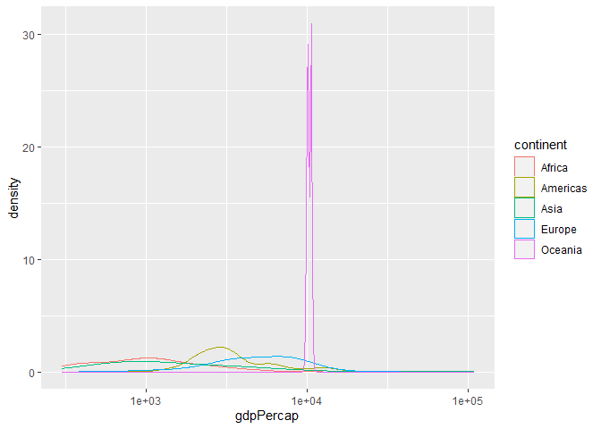<!-- -->

``` r
gapminder %>%
  filter(year == year_min) %>%
  filter(gdpPercap < 30000) %>%
  ggplot(aes(x = gdpPercap, color = continent)) +
    geom_boxplot()
```

<!-- -->

**Observations**:

- Write your observations here

**Difficulties & Approaches**:

- `geom_density` is not a particularly useful visualization because the
  outliers extend the axis beyond the bulk of the distribution.
  - I filtered out the high gdp countries to address this
- A boxplot is an overall better visualization. It handles the one
  extreme value very well but still benefits from the same filter to
  expand the useful real estate for the rest of the visualization.

### **q3** You should have found *at least* three outliers in q2 (but possibly many more!). Identify those outliers (figure out which countries they are).

``` r
## TASK: Identify the outliers from q2
find_outlier <- function(x) {
  return(x < quantile(x, .25) - 1.5*IQR(x) | x > quantile(x, .75) + 1.5*IQR(x))
}

gapminder %>%
  group_by(continent) %>%
  filter(year == year_min) %>%
  mutate(outlier = find_outlier(gdpPercap)) %>%
  filter(outlier)
```

    ## # A tibble: 9 × 7
    ## # Groups:   continent [4]
    ##   country       continent  year lifeExp       pop gdpPercap outlier
    ##   <fct>         <fct>     <int>   <dbl>     <int>     <dbl> <lgl>  
    ## 1 Angola        Africa     1952    30.0   4232095     3521. TRUE   
    ## 2 Bahrain       Asia       1952    50.9    120447     9867. TRUE   
    ## 3 Canada        Americas   1952    68.8  14785584    11367. TRUE   
    ## 4 Gabon         Africa     1952    37.0    420702     4293. TRUE   
    ## 5 Kuwait        Asia       1952    55.6    160000   108382. TRUE   
    ## 6 South Africa  Africa     1952    45.0  14264935     4725. TRUE   
    ## 7 Switzerland   Europe     1952    69.6   4815000    14734. TRUE   
    ## 8 United States Americas   1952    68.4 157553000    13990. TRUE   
    ## 9 Venezuela     Americas   1952    55.1   5439568     7690. TRUE

**Observations**:

- Identify the outlier countries from q2
  - Angola, Bahrain, Canada, Gabon, Kuwait, South Africa, Switzerland,
    United States, and Venezuela

*Hint*: For the next task, it’s helpful to know a ggplot trick we’ll
learn in an upcoming exercise: You can use the `data` argument inside
any `geom_*` to modify the data that will be plotted *by that geom
only*. For instance, you can use this trick to filter a set of points to
label:

``` r
## NOTE: No need to edit, use ideas from this in q4 below
gapminder %>%
  filter(year == max(year)) %>%

  ggplot(aes(continent, lifeExp)) +
  geom_boxplot() +
  geom_point(
    data = . %>% filter(country %in% c("United Kingdom", "Japan", "Zambia")),
    mapping = aes(color = country),
    size = 2
  )
```

<!-- -->

### **q4** Create a plot similar to yours from q2 studying both `year_min` and `year_max`. Find a way to highlight the outliers from q3 on your plot *in a way that lets you identify which country is which*. Compare the patterns between `year_min` and `year_max`.

*Hint*: We’ve learned a lot of different ways to show multiple
variables; think about using different aesthetics or facets.

``` r
## TASK: Create a visual of gdpPercap vs continent
gapminder %>%
  group_by(continent) %>%
  filter(year == year_min) %>%
  mutate(outlier = find_outlier(gdpPercap)) %>%
  ggplot(aes(x = gdpPercap, y = continent, color = continent)) +
    geom_boxplot() + 
    geom_label_repel(
      data = . %>% filter(outlier),
      aes(label = country),
    ) +
    geom_label_repel(
      data = . %>% filter(country == "Kuwait"),
      aes(label = gdpPercap),
      nudge_y = -.35
    ) +
    coord_cartesian(xlim = c(0, 15000)) +
    theme(legend.position = "none")
```

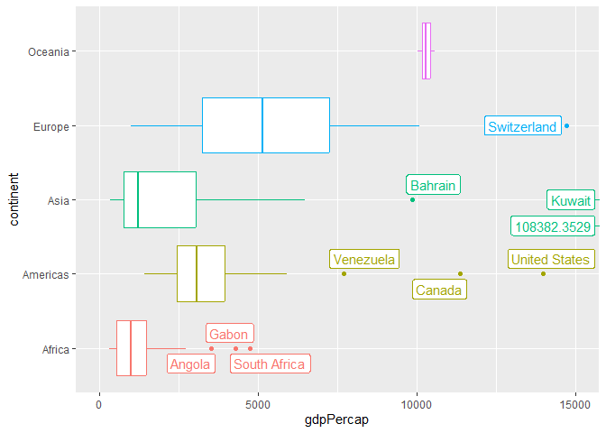<!-- -->

``` r
gapminder %>%
  group_by(continent) %>%
  filter(year == year_max) %>%
  mutate(outlier = find_outlier(gdpPercap)) %>%
  ggplot(aes(x = gdpPercap, y = continent, color = continent)) +
    geom_boxplot() + 
    geom_label_repel(
      data = . %>% filter(outlier),
      aes(label = country),
      max.overlaps = 20
    ) +
    theme(legend.position = "none")
```

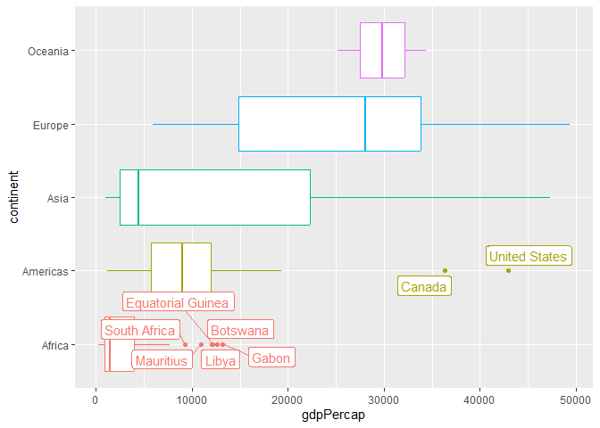<!-- -->

**Observations**:

- Everyone is way richer
- Africa is still really poor
- Asia experienced the moist growth
- The bulk of Europe joined the rest of the richest countries, which are
  less distant from poor countries than they were in the earliest year
- Many outliers dissapeared. I’m not sure if this is a reduction in
  inequality or the US couping anyone that got too far out of place.
  Also some of the wealth may just have been unstable.

# Your Own EDA

<!-- -------------------------------------------------- -->

Now it’s your turn! We just went through guided EDA considering the GDP
per capita at two time points. You can continue looking at outliers,
consider different years, repeat the exercise with `lifeExp`, consider
the relationship between variables, or something else entirely.

### **q5** Create *at least* three new figures below. With each figure, try to pose new questions about the data.

``` r
gapminder %>%
  filter(country != "Kuwait") %>%
  filter(year == 2007) %>%
  ggplot(aes(x=lifeExp, y = gdpPercap, color = continent, label = country)) +
    geom_point() +
    geom_label_repel(show.legend = FALSE, max.overlaps = 10)
```

    ## Warning: ggrepel: 129 unlabeled data points (too many overlaps). Consider
    ## increasing max.overlaps

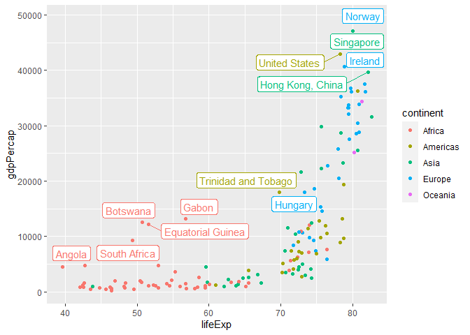<!-- -->

``` r
gapminder %>%
  filter(year == 2007) %>%
  arrange(lifeExp)
```

    ## # A tibble: 142 × 6
    ##    country                  continent  year lifeExp      pop gdpPercap
    ##    <fct>                    <fct>     <int>   <dbl>    <int>     <dbl>
    ##  1 Swaziland                Africa     2007    39.6  1133066     4513.
    ##  2 Mozambique               Africa     2007    42.1 19951656      824.
    ##  3 Zambia                   Africa     2007    42.4 11746035     1271.
    ##  4 Sierra Leone             Africa     2007    42.6  6144562      863.
    ##  5 Lesotho                  Africa     2007    42.6  2012649     1569.
    ##  6 Angola                   Africa     2007    42.7 12420476     4797.
    ##  7 Zimbabwe                 Africa     2007    43.5 12311143      470.
    ##  8 Afghanistan              Asia       2007    43.8 31889923      975.
    ##  9 Central African Republic Africa     2007    44.7  4369038      706.
    ## 10 Liberia                  Africa     2007    45.7  3193942      415.
    ## # … with 132 more rows

- Obviously Kuwait is a huge outlier in terms of `gdpPercap`. There are
  6 years where Kuwait has the highest `gdpPercap`, sometimes by a mile.
  I’ll remove Kuwait to have a better view of everything else.
- There are a handful of countries at the top of `gdpPercap`. Ireland
  comes as a small suprise to me, and there are a handful of Asian
  countries scattered throughout the top of GDP and life expectancy with
  the European colonial powers.
- There are also a few African countries that stand out for having
  relatively high amounts of commercial activity relative to their
  population’s life expectancy. This could be from especially high
  inequality (rich business people do lots of trade, but money doesn’t
  reach the populace) or governmental corruption, or it could be *South
  Africa.*
- There is a point around 70 years `lifeExp` below which countries are
  generally very poor. Past this point, we see a huge range of
  `gdpPercap`. The lower region is almost entirely African with a
  handful of Asian countries.
- Afghanistan is the only Asian country well below 58 years `lifeExp`
  which makes sense with the United States doing United States things
  and all.

``` r
## TASK: Your second graph

# Calculation
gapminder_plus_stability <-
  gapminder %>%
  group_by(country) %>%
  mutate(
    lifeExp_stability = cor(year, lifeExp, method = "spearman"),
    gdpPercap_stability = cor(year, gdpPercap, method = "spearman"),
    rho_lifeExp_gdpPercap = cor(lifeExp, gdpPercap, method = "spearman"),
    total_stability = lifeExp_stability + gdpPercap_stability
    )

stability <-
  gapminder_plus_stability %>%
  filter(continent != "Oceania") %>%
  filter(year == 2007)

# Plotting

stability %>%
  ggplot(aes(x = continent, y = lifeExp_stability, color = continent)) +
    geom_boxplot(show.legend = FALSE)
```

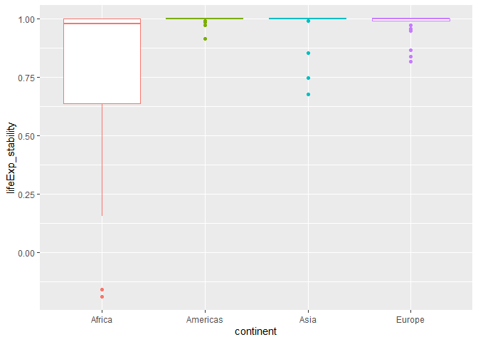<!-- -->

``` r
stability %>%
  group_by(continent) %>%
  mutate(outlier = find_outlier(lifeExp_stability)) %>%
  ggplot(aes(y = lifeExp_stability, color = continent)) +
    geom_boxplot() +
    geom_label_repel(
      data = . %>% filter(outlier),
      aes(label = country, x = 0),
      max.overlaps = 12,
    ) +
  facet_wrap(~ continent) +
  theme(
    axis.text.x=element_blank(),
    axis.ticks.x=element_blank(),
    legend.position = "none"
  )
```

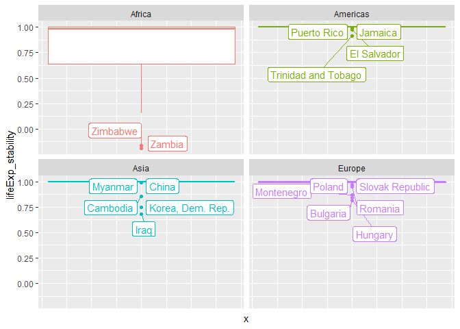<!-- -->

``` r
# stability %>%
#   select(c(country, continent, lifeExp_stability, gdpPercap_stability)) %>%
#   arrange(lifeExp_stability)

stability %>%
  ggplot(aes(x = continent, y = gdpPercap_stability, color = continent)) +
    geom_boxplot(show.legend = FALSE)
```

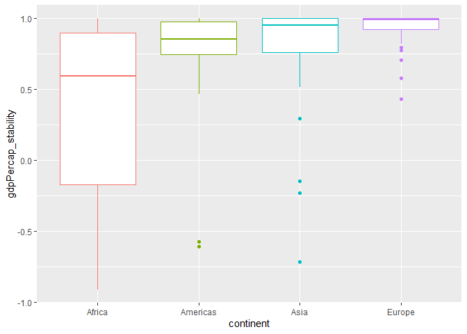<!-- -->

``` r
stability %>%
  group_by(continent) %>%
  mutate(outlier = find_outlier(gdpPercap_stability)) %>%
  ggplot(aes(y = gdpPercap_stability, color = continent)) +
    geom_boxplot() +
    geom_label_repel(
      data = . %>% filter(outlier),
      aes(label = country, x = 0),
      max.overlaps = 12,
    ) +
  facet_wrap(~ continent) +
  theme(
    axis.text.x=element_blank(),
    axis.ticks.x=element_blank(),
    legend.position = "none"
  )
```

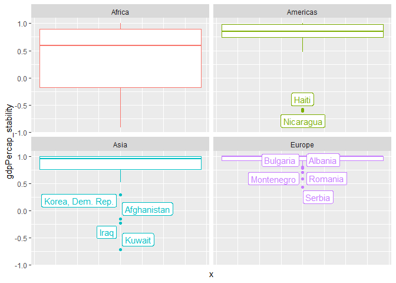<!-- -->

``` r
# stability %>%
#   select(c(country, continent, gdpPercap_stability, lifeExp_stability)) %>%
#   arrange(gdpPercap_stability)

# stability %>%
#   select(
#     c(
#       country,
#       continent,
#       total_stability,
#       gdpPercap_stability,
#       lifeExp_stability
#       )
#     ) %>%
#   arrange(total_stability)
```

- I’ve used the spearman correlation to describe an assumption I think
  is reasonable - I would expect a geopolitically stable country to
  experience an increasing `gdpPercap` and `lifeExp` as time passes. The
  spearman correlation tells us how true this is without looking at the
  rate of increase which varies depending on the state of development of
  a country. This would be worth investigating but seemed difficult with
  only 6 time points.
- I am going to call this measure “stability”. Stability is how
  consistently `lifeExp` and `gdpPercap` increase each year irrespective
  of how much of an increase occurs.
- Africa is by far the most unstable continent in terms of both
  `lifeExp` and `gdpPercap`.
- Outside of Africa, anything less than `1` is considered an outlier for
  `lifeExp_stability`.
- `lifeExp` is far more stable than `gdpPercap`. This makes sense as
  economic turmoil is more common than the type of violence or poverty
  that would decrease life expectancy.
- Because `lifeExp` is broadly more stable with less spread there are
  more outliers.
- All outliers in Europe are Eastern European countries. This brings in
  to question the practice of continent grouping which is ultimately
  arbitrary as there are political and cultural regions that are likely
  more relevant.
- Funny enough, every single country in Asia and the Americas that is an
  outlier in terms of `gdpPercap_stability` was couped or invaded by the
  US!
- Eastern Europe is also the US’s fault but there were a number of
  separate events (largely the rise of capitalism and balkanization)
- Few countries in Africa and the Americas experienced consistent year
  over year growth in `gdpPercap`. Feels like another
  imperialism/colonialism moment.

``` r
## TASK: Your third graph

stability %>%
  ggplot(aes(
    x = gdpPercap_stability,
    y = lifeExp_stability,
    color = continent
    )) +
  geom_point()
```

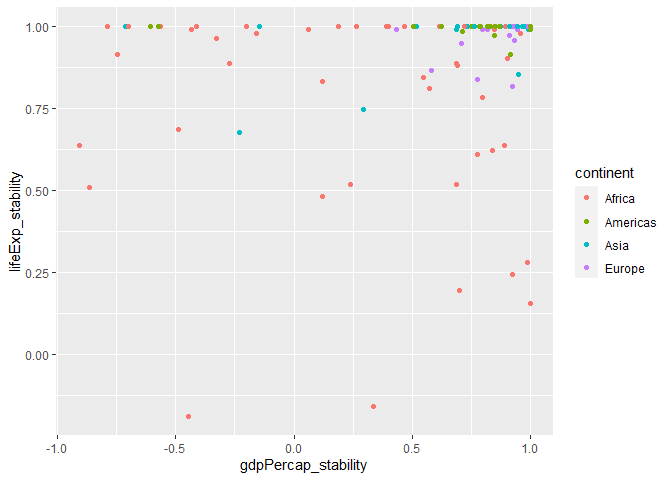<!-- -->

``` r
stability %>%
  filter(gdpPercap_stability == 1 & lifeExp_stability < 1)
```

    ## # A tibble: 5 × 10
    ## # Groups:   country [5]
    ##   country   conti…¹  year lifeExp    pop gdpPe…² lifeE…³ gdpPe…⁴ rho_l…⁵ total…⁶
    ##   <fct>     <fct>   <int>   <dbl>  <int>   <dbl>   <dbl>   <dbl>   <dbl>   <dbl>
    ## 1 Botswana  Africa   2007    50.7 1.64e6  12570.   0.154       1   0.154    1.15
    ## 2 Denmark   Europe   2007    78.3 5.47e6  35278.   0.993       1   0.993    1.99
    ## 3 Netherla… Europe   2007    79.8 1.66e7  36798.   0.993       1   0.993    1.99
    ## 4 Norway    Europe   2007    80.2 4.63e6  49357.   0.993       1   0.993    1.99
    ## 5 Puerto R… Americ…  2007    78.7 3.94e6  19329.   0.993       1   0.993    1.99
    ## # … with abbreviated variable names ¹​continent, ²​gdpPercap, ³​lifeExp_stability,
    ## #   ⁴​gdpPercap_stability, ⁵​rho_lifeExp_gdpPercap, ⁶​total_stability

- While making some of these plots I noticed a limit to my methodology.
  The spearman correlation doesn’t weight a single precipitous drop as
  highly as a couple years of gradual decline. This means we will notice
  certain types of instability but might not highlight major turmoil if
  the country recovers quickly.
- This last plot really should be in a separate section or the others
  should be removed, by I like them all.
- A lot of countries have consistently increasing `lifeExp` (stability
  = 1) but less stable `gdpPercap`.
- Other than the concentration at `lifeExp_stability = 1` the
  distribution of points appears to be fairly random.
- Only one country has perfect `gdpPercap_stability` but poor (\<.9)
  `lifeExp_stability` . Three of the four countries where
  `gdpPercap_stability = 1` but `lifeExp_stability < 1` are Nordic
  countries which are known for their extreme wealth (from exploiting
  the third world) and strong health. This may represent them stagnating
  because they are waiting on new technology to increase lifespan and
  almost everything we can achieve with current technology is already in
  place there. Peurto Rico also shows up which I can’t quite explain but
  they also enjoy a high life expectancy despite being less wealthy.
  Also natural disaster could have come into play.

``` r
stability %>%
  group_by(continent) %>%
  mutate(outlier = find_outlier(total_stability)) %>%
  ggplot(aes(x = total_stability, color = continent)) +
    geom_density()
```

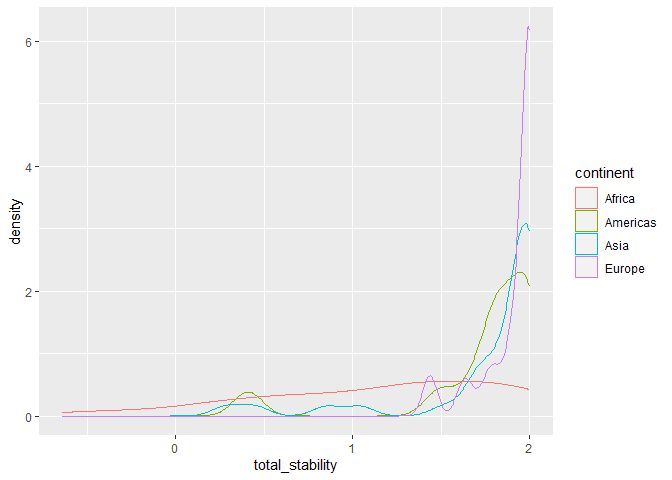<!-- -->

``` r
stability %>%
  group_by(continent) %>%
  mutate(outlier = find_outlier(total_stability)) %>%
  ggplot(aes(x = total_stability, color = continent)) +
    geom_density() +
    geom_point(
      aes(x = total_stability, y = 0),
      size = 1
    ) +
    geom_point(
      data = . %>% filter(outlier),
      aes(x = total_stability, y = 0),
      size = 3
    ) # +
```

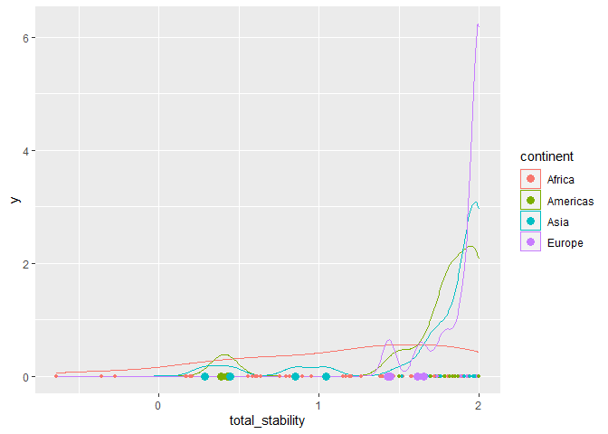<!-- -->

``` r
    # geom_label_repel(
    #     data = . %>% filter(outlier),
    #     aes(label = country, x = total_stability, y = 0),
    # )

stability %>%
  group_by(continent) %>%
  mutate(outlier = find_outlier(gdpPercap_stability)) %>%
  ggplot(aes(x = gdpPercap_stability, color = continent)) +
    geom_density()
```

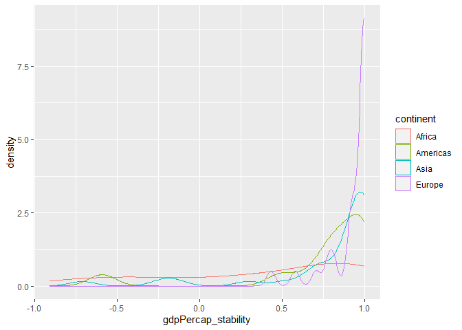<!-- -->

``` r
stability %>%
  group_by(continent) %>%
  mutate(outlier = find_outlier(gdpPercap_stability)) %>%
  ggplot(aes(x = gdpPercap_stability, color = continent)) +
    geom_density() +
    geom_point(
      aes(x = gdpPercap_stability, y = 0),
      size = 1
    ) +
    geom_point(
      data = . %>% filter(outlier),
      aes(x = gdpPercap_stability, y = 0),
      size = 3
    ) # +
```

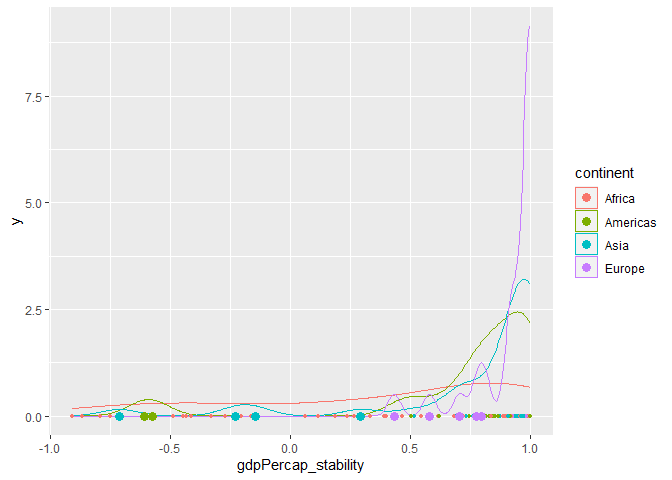<!-- -->

``` r
    # geom_label_repel(
    #     data = . %>% filter(outlier),
    #     aes(label = country, x = gdpPercap_stability, y = 0),
    # )

# gapminder_plus_stability <-
#   gapminder %>%
#   filter(continent != "Oceana") %>%
#   group_by(country) %>%
#   mutate(
#     lifeExp_stability = cor(year, lifeExp, method = "pearson"),
#     gdpPercap_stability = cor(year, gdpPercap, method = "pearson"),
#     rho_lifeExp_gdpPercap = cor(lifeExp, gdpPercap, method = "pearson")
#     )


gapminder_plus_stability %>%
  ggplot(aes(x = year, y = lifeExp, group = country, color = continent)) +
    geom_line(
      data = . %>% filter(lifeExp_stability >= .8),
      size = .3
    ) +
  geom_line(
      data = . %>% filter(lifeExp_stability <= .8),
      size = 1.5,
    )
```

    ## Warning: Using `size` aesthetic for lines was deprecated in ggplot2 3.4.0.
    ## ℹ Please use `linewidth` instead.

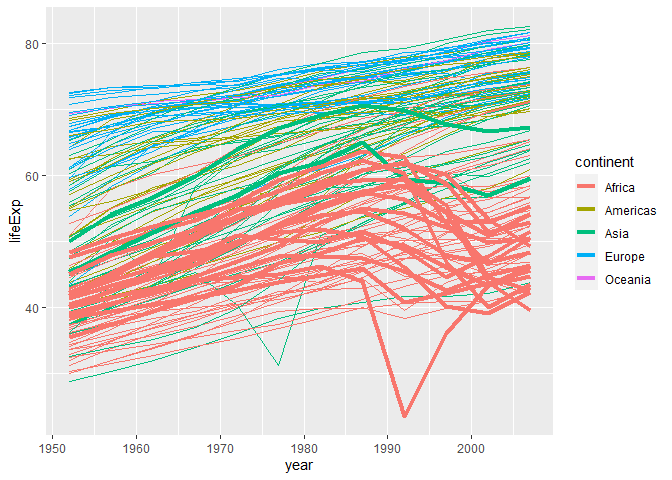<!-- -->

``` r
gapminder %>%
  ggplot(aes(x=lifeExp, y = gdpPercap, color = continent, label = country)) +
    geom_point() +
    geom_label_repel(
      data = . %>% filter(gdpPercap > 58000),
      show.legend = FALSE
    )
```

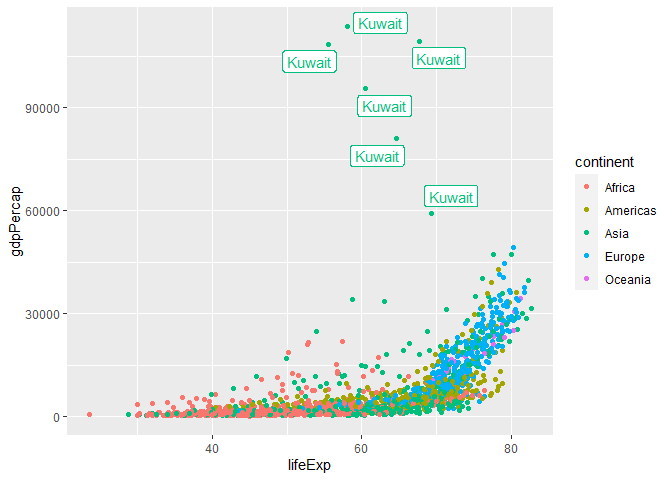<!-- -->

``` r
no_kuwait <-
  gapminder %>%
  filter(country != "Kuwait") %>%
  ggplot(aes(x=lifeExp, y = gdpPercap, color = continent, label = country)) +
    geom_point()

no_kuwait
```

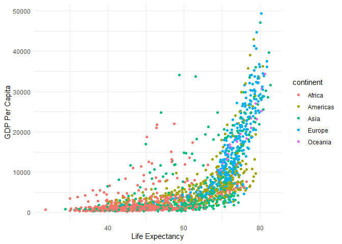<!-- -->

``` r
no_kuwait + facet_wrap(~ year)
```

<!-- -->

``` r
anim <-
  no_kuwait +
  transition_states(
    year,
    transition_length = 2,
    state_length = 0,
    wrap = FALSE
  ) +
  ease_aes('linear') +
  ggtitle('{closest_state}')
```

``` r
# animate(
#   anim,
#   fps = 24, duration = 5,
#   width = 1920, height = 1080, units = "px",
#   renderer = av_renderer()
# )
```
